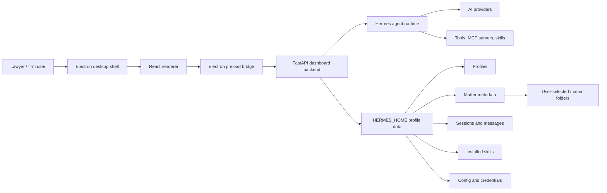
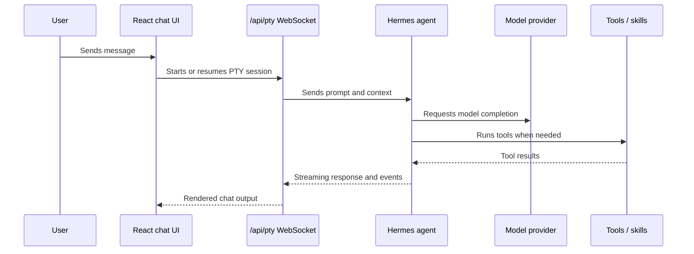
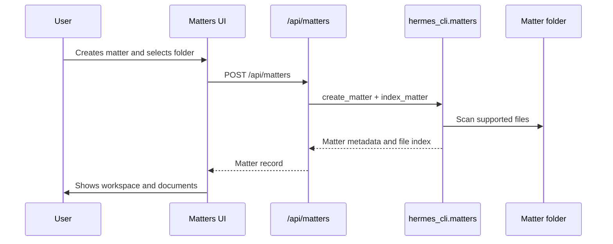

# Architecture Overview

LexEdge Personal AI Assistant is a branded, lawyer-focused desktop product built on the Hermes Agent runtime.

## High-Level Shape

## Runtime Layers

### 1. Electron Shell

Path: `apps/desktop/electron`

Responsibilities:

- Starts and monitors the Python backend.
- Registers desktop APIs on `window.hermesDesktop`.
- Opens local files and external URLs.
- Handles update, boot, crash, and installed app packaging behavior.
- Serves the React renderer from Vite in development or packaged `dist` in production.

### 2. React Desktop UI

Path: `apps/desktop/src`

Responsibilities:

- Shows lawyer-facing app screens.
- Talks to backend APIs through `apps/desktop/src/hermes.ts`.
- Owns UI state, navigation, search, settings panels, and previews.
- Converts backend and session data into non-technical user actions.

Important route files:

- `apps/desktop/src/app/routes.ts`
- `apps/desktop/src/app/index.tsx`
- `apps/desktop/src/app/shell/app-shell.tsx`

Important screens:

- Chat: `apps/desktop/src/app/chat`
- Matters: `apps/desktop/src/app/matters`
- Artifacts: `apps/desktop/src/app/artifacts`
- Messaging: `apps/desktop/src/app/messaging`
- Skills: `apps/desktop/src/app/skills`
- Profiles: `apps/desktop/src/app/profiles`
- Onboarding: `apps/desktop/src/app/onboarding/lawyer-onboarding-wizard.tsx`
- Settings: `apps/desktop/src/app/settings`

### 3. Backend API

Path: `hermes_cli/web_server.py`

Responsibilities:

- FastAPI server for desktop and web dashboard APIs.
- Serves files, sessions, config, skills, toolsets, matters, messaging, profiles, providers, cron, and onboarding state.
- Starts a desktop cron ticker when running inside the desktop app.
- Provides WebSocket endpoints for PTY chat and live events.

Common API groups:

- `/api/config`, `/api/env`, `/api/model/*`
- `/api/providers/*`
- `/api/sessions/*`
- `/api/profiles/*`
- `/api/skills/*`
- `/api/tools/toolsets/*`
- `/api/messaging/*`
- `/api/matters/*`
- `/api/draft-artifacts/export`
- `/api/cron/*`
- `/api/mcp/*`

### 4. Hermes Agent Runtime

Main paths:

- `agent/`
- `cli.py`
- `run_agent.py`
- `hermes_cli/*`
- `tools/`
- `toolsets.py`

Responsibilities:

- Creates AI agent sessions.
- Selects model/provider configuration.
- Executes tools with approval and sandbox policy.
- Loads skills and SOUL/profile instructions.
- Persists sessions and runtime state.

### 5. Profile State

Profiles are isolated Hermes homes. The default profile is `~/.hermes`; named profiles live under `~/.hermes/profiles/<name>`.

Profile data includes:

- `config.yaml`
- `.env`
- `SOUL.md`
- `skills/`
- `sessions/`
- `memories/`
- `cron/`
- `matters/`
- logs and workspace data

Code:

- `hermes_cli/profiles.py`
- `hermes_cli/legal_practice_profiles.py`
- `apps/desktop/src/app/profiles`

## Data Flow: Chat

## Data Flow: Matters

## Data Flow: Generated Drafts

Generated documents can appear through two paths:

1. Chat output mentions local file paths. The markdown renderer detects `.docx`, `.pdf`, `.html`, `.md`, and similar files and shows Open/Download cards.
2. Matter folders are indexed. Artifacts and Matters UI read indexed matter files and show generated documents independent of chat text.

Current implementation points:

- Chat document cards: `apps/desktop/src/components/assistant-ui/markdown-text.tsx`
- Artifacts collection: `apps/desktop/src/app/artifacts/index.tsx`
- Matter documents: `apps/desktop/src/app/matters/index.tsx`
- Export service: `hermes_cli/draft_artifacts.py`

## Architectural Principles

- Local-first by default.
- Profile isolation before enterprise multi-tenancy.
- Matter folders are explicit user boundaries.
- Backend owns persistence; frontend owns presentation.
- Legal output is draft-only unless a human acts.
- Enterprise features should add policy layers, audit, admin controls, and team storage without weakening personal/local workflows.

