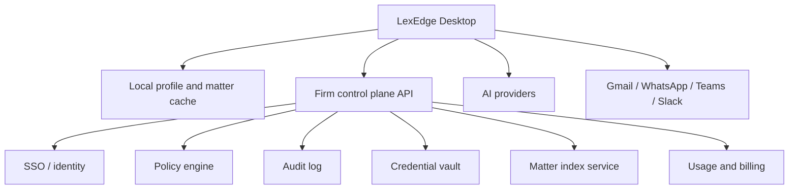

# Data, Security, and Enterprise Readiness

This document explains how data works today and what must be added for enterprise-grade use.

## Current Data Model

LexEdge is local-first. Most user data lives under `HERMES_HOME`.

Default locations:

- macOS/Linux default: `~/.hermes`
- Named profile: `~/.hermes/profiles/<profile-name>`

Profile data includes:

- `config.yaml`: runtime config.
- `.env`: credentials and API keys.
- `SOUL.md`: profile instructions.
- `skills/`: installed skills.
- `sessions/`: chat/session data.
- `memories/`: memory files.
- `cron/`: scheduled jobs.
- `matters/matters.json`: matter metadata and file index.
- `logs/`: backend and desktop logs.

Matter files remain in the lawyer-selected matter folder. LexEdge stores metadata and file paths, not a copied document repository.

## Security Principles

- Local-first by default.
- Explicit user-selected matter folders.
- Profile isolation.
- No automatic filing, sending, or legal action.
- Legal outputs are draft-only until a human approves.
- Technical errors go to logs, not client-facing messages.
- Credentials should be stored in profile-scoped config/env stores.
- Enterprise features must add audit and permissions before adding automation.

## Current Sensitive Areas

| Area | Risk | Required care |
| --- | --- | --- |
| API keys | Provider account compromise | Never display full saved keys. |
| Gmail OAuth | Email access | Use least scopes possible and clear disconnect. |
| WhatsApp bridge | Client communications | Allow disconnect/reconnect and approval-only drafts. |
| Matter folders | Privileged files | Respect matter boundary and avoid broad scanning. |
| Tools/commands | System access | Keep approval controls and log technical failures. |
| Generated drafts | Legal reliance | Mark draft and recommend human review. |

## Enterprise Requirements

Before firm-wide deployment, add:

### Identity and Access

- User accounts.
- Firm/team membership.
- Role-based permissions.
- Admin-managed profiles.
- Matter-level access control.
- Optional SSO: Google Workspace, Microsoft Entra ID, SAML/OIDC.

### Audit

- Audit trail for:
  - Login.
  - Matter access.
  - File indexing.
  - Document generation.
  - Export/download.
  - Messaging send/draft actions.
  - Provider/model changes.
  - Admin settings.
- Immutable or append-only audit store for enterprise mode.

### Data Governance

- Retention policy.
- Matter archive/close.
- Legal hold.
- Export package per matter.
- Secure deletion policy.
- Backup and restore.
- Data residency plan if cloud sync is added.

### Admin Controls

- Approved providers and models.
- Cost limits.
- Tool approval policy.
- Allowed messaging channels.
- Matter folder roots.
- Download/export restrictions.
- Skill allow-list.
- MCP allow-list.

### Compliance and Legal Risk

- User-facing disclaimer.
- AI use policy.
- Human review gates.
- Client confidentiality reminders.
- No unauthorized practice workflows.
- No automated filing unless a firm explicitly approves and audits it.

## Recommended Enterprise Architecture

Enterprise mode should not remove local-first operation. It should add policy and sync layers around it.

## Data Storage Choices

Current storage is intentionally simple:

- JSON for matters.
- YAML/env for config.
- Existing Hermes session storage for chat.

When to move beyond JSON:

- More than one user writes the same data.
- Need audit-safe updates.
- Need query/filter/search across many matters.
- Need server sync.
- Need transaction boundaries.

Recommended enterprise progression:

1. Keep JSON for personal local mode.
2. Add SQLite for local matter metadata if queries grow.
3. Add central Postgres for firm control plane.
4. Add object storage for firm-managed document copies only if firm policy requires it.
5. Add vector/search indexes only after access control design is complete.

## Secure Messaging Guidance

Gmail:

- Use OAuth, not password entry.
- Allow profile-specific filters.
- Do not fetch every email by default.
- Let the user choose labels, senders, date windows, or query filters.
- Store tokens securely and provide disconnect.

WhatsApp:

- Show QR setup in-app.
- Show connected/disconnected state.
- Allow disconnect/reconnect.
- Keep replies approval-only by default.
- Send user-safe processing messages.
- Do not send technical exceptions to the user.

## Logging Guidance

Logs should capture:

- Technical exceptions.
- Backend tracebacks.
- Provider validation errors.
- Messaging bridge failures.
- File indexing failures.

Logs should not expose in normal UI:

- Stack traces.
- Internal class names.
- Raw credentials.
- Full OAuth tokens.
- Sensitive document contents.

## Threat Model Checklist for New Features

For every new feature, answer:

- What files or messages can it read?
- What can it write or send?
- Is it profile-scoped?
- Is it matter-scoped?
- Does it need human approval?
- Is there an audit event?
- Can it reveal credentials?
- Can it leak one client's data into another matter?
- What happens when it fails?
- Is the lawyer-facing error safe and understandable?

