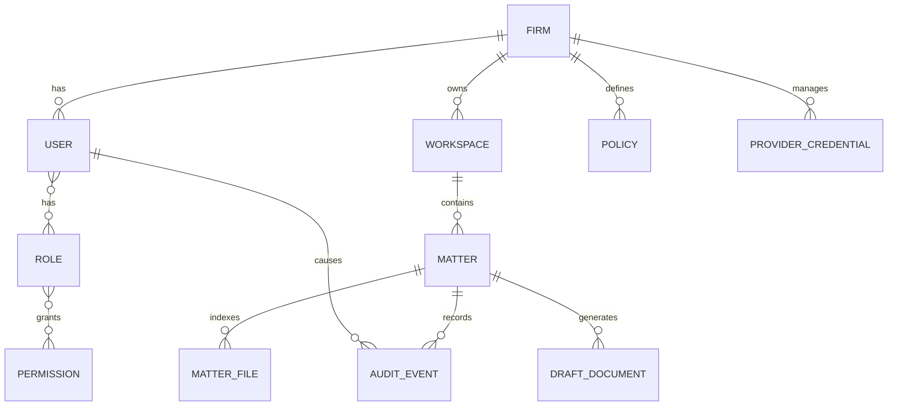

# Roadmap for Future Enterprise Features

This document describes a practical path for turning LexEdge Personal AI Assistant into a firm-ready enterprise product while preserving the personal/local workflow.

## Product North Star

LexEdge should remain simple for individual lawyers while adding firm controls for enterprise users.

Core promise:

- A lawyer can create a matter, attach files, ask legal questions, generate drafts, review outputs, and export documents without technical configuration.
- A firm can manage users, providers, policies, audit, and matter access centrally.

## Phase 1: Personal Lawyer Product

Already started:

- LexEdge branding.
- Lawyer onboarding wizard.
- Practice profiles.
- Legal India skills.
- Matter workspaces.
- Generated document cards.
- Artifacts cleanup.
- Gmail and WhatsApp setup.
- Draft-only legal guardrails.

Next improvements:

- Better document preview for Word/PDF/HTML.
- Folder watch for matter documents.
- Matter chronology and notes.
- Matter stage and deadline fields.
- Cleaner first-run provider setup.
- Safer, friendlier error messages everywhere.

## Phase 2: Professional Practice Features

Target users:

- Individual advocate.
- Small chamber.
- Legal consultant.

Features:

- Matter dashboard.
- Generated documents tab.
- Client update templates.
- Limitation and hearing reminders.
- Gmail filter presets by practice type.
- WhatsApp approval queue.
- Legal research/citation workflow.
- Draft comparison and redline review.
- Exported document templates with letterhead support.

Technical work:

- Add local SQLite matter metadata if JSON becomes too limited.
- Add local document preview/conversion pipeline.
- Add event records for generated documents and matter actions.
- Add a matter file watcher.

## Phase 3: Small Firm Features

Target users:

- 2 to 25 lawyer firm.
- Shared support staff.

Features:

- Firm profile.
- Team roles.
- Matter owner and assigned users.
- Conflict check workflow.
- Shared templates.
- Shared matter folder roots.
- Admin-managed providers.
- Team-safe approval workflow for drafts and messages.
- Matter-level audit.

Technical work:

- Add identity layer.
- Add role and permission model.
- Add audit event model.
- Add firm settings.
- Add policy checks before tools, messaging, export, and file access.

## Phase 4: Enterprise Firm Platform

Target users:

- Larger law firms.
- Corporate legal departments.
- Regulated teams.

Features:

- SSO.
- Central admin console.
- Provider and model policy.
- Credential vault.
- Matter-level access control.
- Enterprise audit and retention.
- Data loss prevention hooks.
- Private deployment options.
- Firm knowledge search.
- Document management system integration.
- Billing and usage analytics.

Technical work:

- Firm control plane API.
- Central database.
- Object/document store if needed.
- Tenant and workspace model.
- Policy engine.
- Audit log storage.
- Admin UI.
- Sync protocol for desktop clients.

## Enterprise Domain Model Draft

## Build Versus Buy Guidance

Build inside LexEdge:

- Matter UX.
- Legal workflow UI.
- Draft generation and review.
- AI policy gates.
- Matter-specific prompts and skills.
- Local-first profile behavior.

Integrate rather than rebuild:

- SSO.
- Document management systems.
- Email providers.
- Calendar providers.
- e-signature.
- Billing/accounting.
- Court or government portals where official APIs exist.

## Enterprise Readiness Checklist

Before selling enterprise use, ensure:

- SSO and user lifecycle exist.
- Admin can disable risky tools.
- Admin can choose approved providers/models.
- Audit captures sensitive actions.
- Matter access is enforced.
- Messaging sends require permission and review.
- Exports are logged.
- Legal disclaimers and human review gates are visible.
- Backup and restore are tested.
- Support can collect logs without exposing client files.

